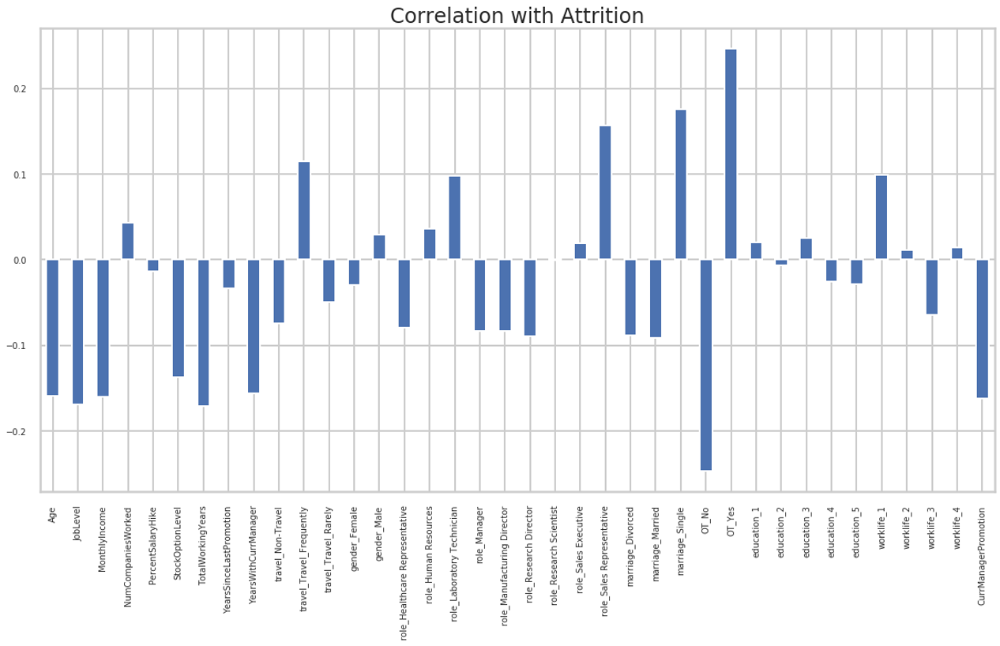

# Employee Retention Analysis

## Overview
According to [Gallup](https://www.gallup.com/workplace/247391/fixable-problem-costs-businesses-trillion.aspx)the annual overall employee turnover rate for 2017 in the U.S. was **26.3%**. The Bureau of Labor Statistics estimates that for 100-person organization where the average salary is $50,000/year, this turnover rate results financial losses of approximately $660,000 to $2.6m / year. So what causes employees to leave? This fictional dataset from IBM hosts survey responses to 35 questions from 1470 individuals to evaluate key variables for retention.

Metric | XGBoost | Random Forest | KNN
------------ | ------------- | ------------- | -------------
Hyperparameters | Upscale Attrition | test_size=0.1 | standard
Accuracy | .83 | .85 | .79
F1 | .43 | .51 | .33

## Recommendations
1. Hire a diverse age range of employees. Married and older employees have lower attrition.
2. Conduct comprehensive surveys. Then, either ditch or improve employee training programs.
3. Offer Overtime or other financial reward incentives beyond salary.

## Tools
- XGBoost Model
- Random Forest Model
- KNN Model

**Data Source** 
1. [IBM HR Analytics Employee Attrition & Performance](https://www.kaggle.com/pavansubhasht/ibm-hr-analytics-attrition-dataset)

**Survey Questions** 

Education 
1. 'Below College'
2. 'College'
3. 'Bachelor'
4. 'Master'
5. 'Doctor'

EnvironmentSatisfaction
1. 'Low'
2. 'Medium'
3. 'High'
4. 'Very High'

JobInvolvement
1. 'Low'
2. 'Medium'
3. 'High'
4. 'Very High'

JobSatisfaction
1. 'Low'
2. 'Medium'
3. 'High'
4. 'Very High'

PerformanceRating
1. 'Low'
2. 'Good'
3. 'Excellent'
4. 'Outstanding'

RelationshipSatisfaction
1. 'Low'
2. 'Medium'
3. 'High'
4. 'Very High'

WorkLifeBalance
1. 'Bad'
2. 'Good'
3. 'Better'
4. 'Best'
